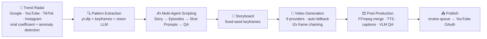

<div align="center">


# 🎬 AI Video Factory

### The viral-video intelligence platform that turns worldwide trends into publish-ready video series.

**Not "another AI video generator."** AI Video Factory continuously watches what's going viral across YouTube, TikTok, Instagram and Google Trends worldwide, **decodes *why* it works** — hook, narrative, emotion, characters — and turns those exact patterns into complete, consistent-character video series. Then it publishes them for you.

**Trend intelligence → viral pattern → script → storyboard → video series → YouTube. One pipeline. No human in the loop.**

[](https://www.python.org/)
[](https://fastapi.tiangolo.com/)
[](https://nextjs.org/)
[](https://www.docker.com/)
[](CONTRIBUTING.md)
[](LICENSE)

[Quick Start](#-quick-start) · [Trend Intelligence](#-trend-intelligence-the-part-nobody-else-has) · [How It Works](#-how-it-works) · [Features](#-features) · [Supported Models](#-supported-models) · [Roadmap](#-roadmap)

</div>

---

## 💡 The Problem

Short-form video is the fastest-growing content format on Earth — and the most labor-intensive to produce consistently. A single competitive channel needs **trend research, viral-format analysis, scriptwriting, consistent characters, video generation, voiceover, captions, editing and publishing — every single day.**

Every existing AI tool solves one step. Prompt-to-video tools make you invent the idea, guess the format, and hope. **The videos that actually win aren't guessed — they're engineered from what's already winning.**

That's what this platform does.

---

## 📡 Trend Intelligence — the part nobody else has

AI Video Factory doesn't wait for your prompt. It runs a **worldwide viral-content radar**:

- **4 live trend sources** — Google Trends (any region), YouTube Data API, TikTok and Instagram Reels scraping — polled on a schedule, per niche, per keyword, per country.
- **Virality analytics, not view counts** — every video gets a **viral coefficient** (views relative to channel size) and **anomaly detection** flags breakout content *while it's still breaking out*.
- **Multimodal pattern extraction** — for any viral video, the platform downloads it (`yt-dlp`), cuts 6 keyframes (`ffmpeg`), and feeds **actual frames + transcript** to a vision LLM. It doesn't guess from the title — it *watches the video* and returns a structured, reusable pattern: character card, hook type, story beats, pacing, CTA, on-screen text.
- **A taxonomy of 12 proven hook types** (POV, cliffhanger, curiosity gap, shocking stat, pattern interrupt…) plus narrative structures ("Hook → Conflict → Twist → CTA") extracted from real winners and applied to your scripts.
- **Niche packs out of the box** — astrology, relationships, motivation, finance and more, with per-locale keywords for multi-market channels.

The output isn't inspiration. It's a **generation brief** the rest of the pipeline executes end-to-end.

---

## 🔥 Why it wins

| | Prompt-to-video tools | **AI Video Factory** |
|---|---|---|
| **Where ideas come from** | You invent them | A worldwide trend radar finds them — with virality scores |
| **Format** | You guess what works | Extracted from actual viral videos: frames + transcript → structured pattern |
| **Characters** | Different face every scene | **Fixed-seed storyboard + i2v frame chaining** → same character across all episodes |
| **Models** | One provider, one point of failure | **9 video/image providers**, runtime routing, automatic fallback, moderation auto-retry |
| **Quality control** | You watch every clip | **VLM-based QA** detects black frames, face artifacts, watermarks → regenerates automatically |
| **Voiceover & captions** | Separate tools | Built-in TTS with word-level timings (incl. a free provider) → dynamic captions |
| **Publishing** | Download, upload, repeat | Review queue → **YouTube OAuth auto-publish**, scheduling included |
| **Cost model** | Monthly SaaS subscription | **Self-hosted** — pay only your own API usage |

---

## ⚙️ How It Works



<details>
<summary><b>Full architecture diagram</b></summary>

```
  Frontend (Next.js 16 + React 19 + TS + Tailwind)
        │
        │  REST / SSE
        ▼
  ┌──────────────────────────────────────────────────────────┐
  │  Backend (FastAPI + async + Pydantic)                    │
  │                                                          │
  │  ┌──────────────┐    ┌──────────────────────────────┐   │
  │  │ Trend Radar  │───▸│  AI Orchestrator             │   │
  │  │              │    │                              │   │
  │  │ Google RSS   │    │  ┌─────────┐  ┌─────────┐    │   │
  │  │ YouTube API  │    │  │  Story  │─▸│ Episode │    │   │
  │  │ TikTok scr.  │    │  │  Agent  │  │  Agent  │    │   │
  │  │ IG Reels     │    │  └─────────┘  └────┬────┘    │   │
  │  └──────────────┘    │                    ▼         │   │
  │                      │  ┌─────────┐  ┌─────────┐    │   │
  │                      │  │ Quality │◂─│  Shot   │    │   │
  │                      │  │ Checker │  │ Prompt  │    │   │
  │                      │  └────┬────┘  └─────────┘    │   │
  │                      └───────┼────────────────────────┘ │
  │                              ▼                          │
  │  ┌───────────────────────────────────────────────────┐  │
  │  │  Media Layer (provider abstraction + routing)     │  │
  │  │                                                   │  │
  │  │  Video: Veo 3.1 · Seedance · MiniMax · Kling     │  │
  │  │         Pika · WaveSpeed · Vertex · Gemini       │  │
  │  │  Image: Flux · Nano Banana · Seedream            │  │
  │  │  TTS:   ElevenLabs · Edge TTS                    │  │
  │  │  ASR:   Whisper (self-hosted alignment)          │  │
  │  └─────────────────────┬─────────────────────────────┘  │
  │                        ▼                                │
  │  ┌────────────────────────────────────────────────┐     │
  │  │  Post-processing: FFmpeg merge + VLM QA        │     │
  │  └────────────────────────┬───────────────────────┘     │
  │                           ▼                             │
  │  ┌────────────────────────────────────────────────┐     │
  │  │  Review queue + YouTube auto-publish (OAuth)   │     │
  │  └────────────────────────────────────────────────┘     │
  │                                                         │
  │  Job orchestration: Redis + RQ worker                   │
  │  Storage:           SQLite (SQLAlchemy, WAL)            │
  └─────────────────────────────────────────────────────────┘
```

</details>

---

## ✨ Features

| | Feature | How it works |
|---|---|---|
| 📡 | **Worldwide trend radar** | 4 sources (Google Trends, YouTube, TikTok, Instagram), any region, per-niche keyword packs, scheduled auto-fetch |
| 📈 | **Virality analytics** | Viral coefficient (views vs channel size), anomaly detection for breakout content, favorites, keyword filters |
| 🔍 | **Multimodal pattern extraction** | Downloads the viral video, cuts 6 keyframes, feeds frames + transcript to a vision LLM → structured, reusable brief |
| 🧠 | **12 hook types + narrative structures** | Extracted from real viral winners, applied to every generated script |
| ✍️ | **Multi-agent scripting** | Story Agent → Episode Agent → Shot Prompt Agent → Quality Checker → Moderation Softener. A pipeline, not a "magic prompt" |
| 🎨 | **Consistent characters** | Fixed-seed storyboard keyframes + image-to-video frame chaining — the hardest problem in AI video, solved at the pipeline level |
| 🎥 | **9 video/image providers** | Veo 3.1, Seedance 2.0, MiniMax Hailuo, Kling, Pika, WaveSpeed, Flux, Nano Banana, Seedream — routed at runtime, automatic fallback |
| 🗣 | **Voiceover with word timings** | ElevenLabs (native timestamps) or **free Edge TTS**; Whisper forced alignment → dynamic captions |
| 🎞 | **FFmpeg post-production** | Episode stitching with transitions, TTS sync, caption burn-in, video extension up to 148s via frame chaining |
| ✅ | **VLM-based QA** | Vision models score every frame for character consistency and defects; bad frames regenerate automatically |
| 📤 | **YouTube auto-publish** | OAuth 2.0 with encrypted tokens, review queue (approve / reject / schedule), upload quota tracking |
| 📊 | **Analytics & monitoring** | Per-video stats, system health dashboard, Telegram/email alerts |
| 🌐 | **Bilingual UI** | English / Russian out of the box, custom lightweight i18n |
| 🔐 | **Production hardening** | SSRF-safe outbound fetches, optional API-key auth, encrypted OAuth tokens, path-traversal-safe uploads, retry/fallback everywhere |

---

## 🚀 Quick Start

Runs anywhere Docker runs. Two API keys get you generating; every extra key unlocks another provider automatically.

```bash
# 1) Clone
git clone https://github.com/AndreySukhanov/ai-video-factory.git
cd ai-video-factory

# 2) Add API keys
cp backend/.env.example backend/.env
# Minimum viable setup — two keys:
#   OPENROUTER_API_KEY=...   # any LLM (or ANTHROPIC_API_KEY / OPENAI_API_KEY)
#   REPLICATE_API_TOKEN=...  # any video provider (or GEMINI_API_KEY / WAVESPEED_API_KEY)

# 3) Run
docker compose up -d --build

# Frontend → http://localhost:3000
# Backend  → http://localhost:8000
# API docs → http://localhost:8000/docs
```

---

## 🎬 Use Cases

### Clone a breakout TikTok — before the trend peaks

```
POST /api/v1/trends/{trend_id}/clone-brief
# → the radar already flagged it as an anomaly (viral coefficient ≫ channel size)
# → multimodal extraction: yt-dlp + 6 keyframes + vision LLM → structured brief
# → fixed-seed storyboard → keyframes with your consistent character
# → i2v generation chained frame-to-frame → FFmpeg merge
# → a finished video in the same proven format, with your character
```

### Story Mode — a series from one sentence

```
POST /api/v1/episodes/generate-series
{ "idea": "A detective investigates mysterious disappearances in a coastal town",
  "genre": "thriller", "episodes": 6 }
# → multi-agent: story → episode prompts → shot prompts → quality check
# → batch generation with frame chaining → auto-merged into one file
```

### Fully hands-off channel

```
GET  /api/v1/trends/discover     # scan what's going viral right now
POST /api/v1/episodes/generate   # generate the videos
POST /api/v1/episodes/merge      # stitch
POST /api/v1/youtube/publish     # publish
```

---

## 🎥 Supported Models

| Type | Models |
|---|---|
| **Video** | Google Veo 3.1 (Vertex AI + Gemini API), Seedance 2.0 PRO, MiniMax Hailuo 02, Kling 3.0, Pika, WaveSpeed |
| **Image / storyboard** | Gemini Nano Banana, Flux 1.1 Pro Ultra, Seedream |
| **LLM** | Claude (Opus / Sonnet / Haiku), GPT, DeepSeek — via OpenRouter, Anthropic, OpenAI or LaoZhang |
| **TTS** | ElevenLabs (word-level timestamps), Edge TTS (free, no key needed) |
| **ASR / alignment** | faster-whisper (self-hosted) |

New provider = one class implementing `video_provider_base.py`. PRs welcome.

<details>
<summary><b>📚 API endpoints</b></summary>

| Method | Endpoint | Purpose |
|---|---|---|
| `GET` | `/api/v1/trends/` | Trending videos worldwide (Google + YouTube + TikTok + IG) |
| `POST` | `/api/v1/trends/fetch` | Refresh the trend radar for a region/niche |
| `POST` | `/api/v1/trends/{id}/clone-brief` | Multimodal extraction → structured generation brief |
| `POST` | `/api/v1/episodes/generate` | Generate one episode (t2v or i2v) |
| `POST` | `/api/v1/episodes/generate-series` | Multi-agent script for a series |
| `POST` | `/api/v1/episodes/storyboard` | Fixed-seed keyframes with VLM consistency audit |
| `POST` | `/api/v1/episodes/merge` | FFmpeg merge of episodes |
| `POST` | `/api/v1/episodes/extend` | Extend video: last frame → continue → concat |
| `POST` | `/api/v1/episodes/voiceover` | TTS with word-level timings |
| `POST` | `/api/v1/episodes/captions` | Burn dynamic captions |
| `GET` | `/api/v1/review/queue` | Review queue with VLM QA |
| `GET` | `/api/v1/youtube/auth/url` | Connect a YouTube channel (OAuth) |
| `GET` | `/api/v1/analytics/health` | System health + provider status |

Full Swagger docs at `http://localhost:8000/docs`.

</details>

<details>
<summary><b>📁 Project structure</b></summary>

```
ai-video-factory/
├── frontend/                         # Next.js 16 + TS
│   └── src/
│       ├── app/                      # App Router pages (generate, trends, review, dashboard)
│       ├── features/generate-v2/     # Multi-step generation wizard
│       ├── contexts/                 # i18n LanguageContext
│       └── lib/api/                  # Typed API client
│
├── backend/
│   └── app/
│       ├── api/v1/                   # FastAPI routers (thin delegates)
│       ├── ai_orchestrator/
│       │   ├── llm_client.py         # Unified multi-provider LLM client
│       │   └── agents/               # Story, Episode, ShotPrompt, QualityChecker, Softener
│       ├── media/                    # Video / image / TTS providers (one base class)
│       ├── services/
│       │   ├── trendwatcher/         # Trend radar: 4 sources + pattern extractor + niches
│       │   ├── episode_generation_service.py  # Generation flow (routing, fallback, chaining)
│       │   └── generation_service.py # Job orchestration (Redis + RQ)
│       ├── models/                   # SQLAlchemy models
│       └── main.py                   # FastAPI app + startup migrations
│
└── docker-compose.yml                # Redis + Backend + Worker + Frontend
```

</details>

<details>
<summary><b>🔑 Environment variables</b></summary>

| Variable | Description | Required |
|----------|-------------|----------|
| `OPENROUTER_API_KEY` / `ANTHROPIC_API_KEY` / `OPENAI_API_KEY` | LLM provider (at least one) | ✅ |
| `REPLICATE_API_TOKEN` | Replicate: Veo / MiniMax / Pika | For video |
| `GEMINI_API_KEY` | Gemini API: Veo 3.1 + Nano Banana | Optional |
| `VERTEX_PROJECT_ID` + service-account key | Vertex AI native Veo 3.1 | Optional |
| `WAVESPEED_API_KEY` | WaveSpeed Seedance 2.0 | Optional |
| `LAOZHANG_API_KEY` | OpenAI-compatible proxy (Claude + Seedance + Veo) | Optional |
| `ELEVENLABS_API_KEY` | Premium TTS (Edge TTS works without any key) | Optional |
| `YOUTUBE_API_KEY` | YouTube Data API v3 (trend source) | For YT trends |
| `APIFY_API_TOKEN` / `RAPIDAPI_KEY` | TikTok / Instagram scraping | For social trends |
| `YOUTUBE_CLIENT_ID` + `YOUTUBE_CLIENT_SECRET` + `ENCRYPTION_KEY` | OAuth publishing | For auto-publish |
| `API_AUTH_KEY` | Protect the API with an X-API-Key header | Optional |
| `TELEGRAM_BOT_TOKEN` + `TELEGRAM_CHAT_ID` | Health alerts to Telegram | Optional |

Full template: `backend/.env.example`

</details>

---

## 🗺 Roadmap

- [ ] **Voice cloning** — speaker-specific TTS from a 30-second reference
- [ ] **Hook A/B testing** — automatic split test of the first 3 seconds
- [ ] **Music generation** — Suno / Udio integration for soundtracks
- [ ] **Multi-platform publishing** — TikTok / Instagram Reels APIs
- [ ] **Analytics feedback loop** — CTR / retention per series feeds back into the trend radar
- [ ] **One-click cloud deploy** — Railway / Fly.io / DO templates

Vote with 👍 on [issues](https://github.com/AndreySukhanov/ai-video-factory/issues), or open a new one.

---

## 🤝 Contributing

The provider layer is intentionally plug-and-play: adding a video model is a single class implementing `generate_clip()`. Great first contributions:

- A new video/image/TTS provider
- A new trend source adapter or niche keyword pack
- UI dictionary translations

See [CONTRIBUTING.md](CONTRIBUTING.md). Open an issue first for bigger changes — happy to discuss architecture.

---

## ⭐ Support the project

If this project saved you time or showed you something new — **star it**. It genuinely helps others discover it.

[](https://star-history.com/#AndreySukhanov/ai-video-factory&Date)

---

## 📄 License

**Source-Available** — free to read, run and learn from. Commercial or derivative use requires written permission. See [LICENSE](LICENSE).

Licensing contact: avsukhanov21@gmail.com

---

<div align="center">

**Built with ⚙️ FastAPI + 🎨 Next.js + 🧠 multi-agent LLM orchestration**

[GitHub](https://github.com/AndreySukhanov) · [LinkedIn](https://www.linkedin.com/in/andrei-sukhanov-2605821b9)

</div>
